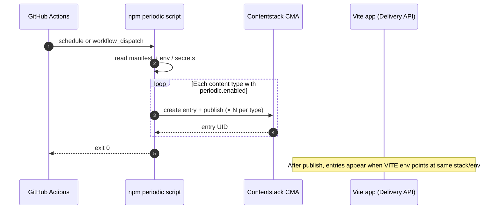
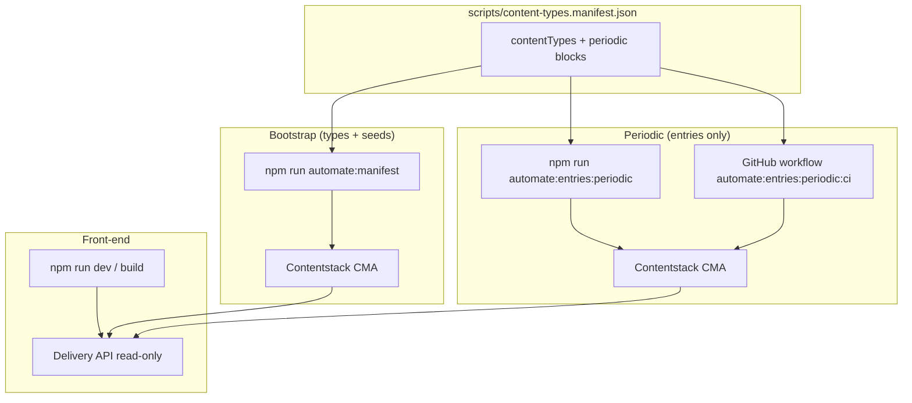

# Top URL lines — Contentstack front-end

Minimal Vite + React site that lists entries from the Contentstack content type **`top_url_lines`** via the [Content Delivery API](https://www.contentstack.com/docs/developers/apis/content-delivery-api).

## Local setup

1. Copy environment template and fill in values from your stack (never commit `.env`):

   ```bash
   cp .env.example .env
   ```

2. **Variables**

   | Variable | Where to find it |
   |----------|-------------------|
   | `VITE_CONTENTSTACK_API_KEY` | Stack API key |
   | `VITE_CONTENTSTACK_DELIVERY_TOKEN` | Stack → Settings → Tokens → **Delivery Tokens** |
   | `VITE_CONTENTSTACK_ENVIRONMENT` | Environment uid (e.g. `production`) from **Settings → Environments** |
   | `VITE_CONTENTSTACK_DELIVERY_HOST` | **Content Delivery URL** from Stack → Settings → Stack (no trailing slash) |
   | `VITE_CONTENTSTACK_CONTENT_TYPE_UIDS` | Optional. Comma-separated content type UIDs to list (default `top_url_lines`). After running `npm run automate:manifest`, include every UID you created (e.g. `top_url_lines,auto_lines_batch_a,auto_lines_batch_b`). |

3. **Publish content** — The Delivery API returns only **published** entries. Unpublished items will not appear until you publish them to the environment you set in `VITE_CONTENTSTACK_ENVIRONMENT`.

4. Install and run:

   ```bash
   npm install
   npm run dev
   ```

5. Production build:

   ```bash
   npm run build
   ```

   Output is written to **`dist/`**.

### Security note

`VITE_*` variables are embedded in the client bundle. The delivery token is visible in the browser. Use a read-only delivery token and accept this tradeoff for static hosting, or add a server-side proxy later if you need to hide credentials.

## Architecture & automation (overview)

Typical use cases:

| Flow | When to use it |
|------|----------------|
| **Local / one-off bootstrap** | Run `npm run automate:manifest` to create missing content types from the manifest and **seed** entries (references, taxonomy placeholders). |
| **Scheduled or manual entries** | Run `npm run automate:entries:periodic` (or the GitHub Action) to **only** create + publish new rows for types with `periodic.enabled` — no schema changes. |
| **Contentstack Launch** | Connect the repo; build outputs `dist/`; set `VITE_*` for the Delivery API so the app lists **published** entries. |
| **Demo / load-style churn** | Periodic job + `CONTENTSTACK_PERIODIC_COUNT` (see below) — watch [Management API](https://www.contentstack.com/docs/developers/apis/content-management-api) limits and clean up test data. |

### Periodic run: how many entries?

For each content type in [`scripts/content-types.manifest.json`](scripts/content-types.manifest.json) with `periodic.enabled`, the script creates **N** entries per **workflow run**, where **N** is resolved in this order:

1. **`periodic.count`** in the manifest — if this property is a **number**, it wins and **ignores** `CONTENTSTACK_PERIODIC_COUNT`.
2. Otherwise **`CONTENTSTACK_PERIODIC_COUNT`** (e.g. GitHub Actions secret).
3. Otherwise **`defaults.periodicCount`** in the manifest.
4. Otherwise **1**.

So if you set the secret to **20** but each type still had `"count": 1` in the manifest, you would only get **one** new entry per type per run. Omitting `periodic.count` lets the secret control volume — e.g. **3** enabled types × **20** × **6** runs/hour (every 10 min) ⇒ **360** new entries/hour until you change cron or count.

### Sequence: GitHub Actions → Contentstack



### Flow: local vs CI vs browser



Details, secrets, and placeholders: **[AUTOMATION.md](./AUTOMATION.md)**.

## Contentstack Launch

1. Push this repo to GitHub or Bitbucket.
2. In Contentstack, open **Launch** → **New project** → **Import from a Git repository**.
3. Connect the repo and branch (e.g. `main`). Set **root directory** to the repo root unless this app lives in a monorepo subfolder.
4. Build settings:

   | Setting | Value |
   |---------|--------|
   | Install | `npm ci` or `npm install` |
   | Build | `npm run build` |
   | Output directory | `dist` |

5. Add the same four **`VITE_CONTENTSTACK_*`** variables in Launch **Environment variables** for production builds.
6. Use Node **20** (or current LTS) in the project settings if the default Node version fails the build.

Optional: trigger redeploys when content publishes (webhook, GitHub Action, or Launch deploy hook). For **multi-field manifests**, **`npm run automate:manifest`**, **`npm run automate:entries:periodic`** (every 10 minutes via [`.github/workflows/contentstack-periodic-entries.yml`](.github/workflows/contentstack-periodic-entries.yml)), and taxonomy/reference placeholders, see **[AUTOMATION.md](./AUTOMATION.md)**.

## References

- [Launch overview](https://www.contentstack.com/docs/developers/launch)
- [Launch quick start (generic CSR)](https://www.contentstack.com/docs/developers/launch/quick-start-generic-csr)
