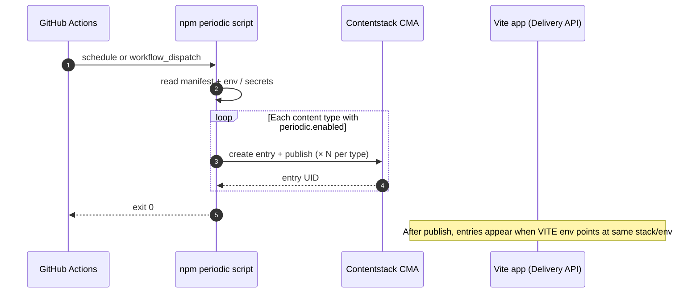
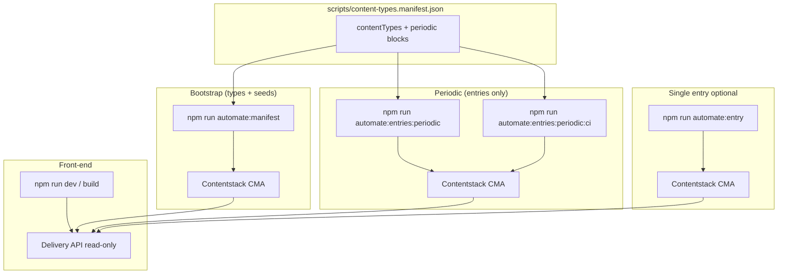
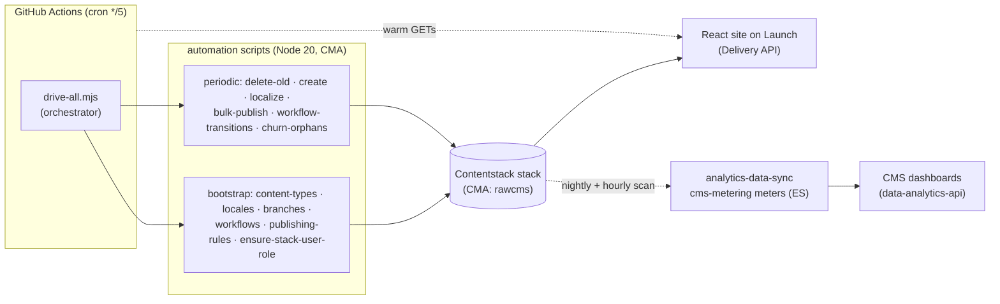
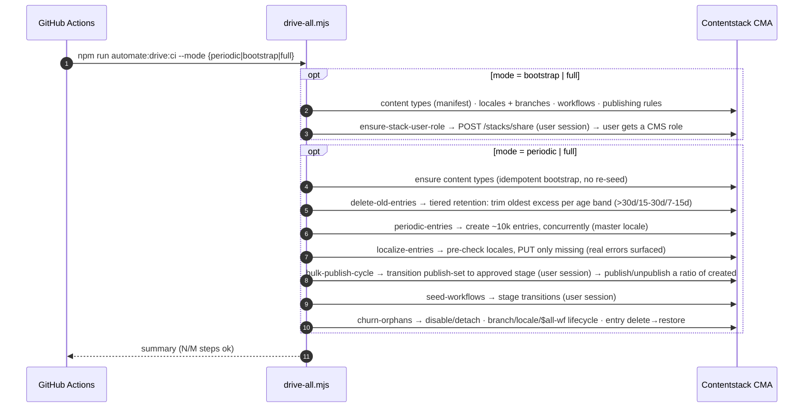

# Top URL lines — Contentstack front-end

Vite + React app that lists **published** entries for one or more content types through the [Content Delivery API](https://www.contentstack.com/docs/developers/apis/content-delivery-api), with **one URL per entry** (`/entry/:contentTypeUid/:entryUid`). The home page includes a small **Three.js** hero (React Three Fiber) for decoration. If you omit `VITE_CONTENTSTACK_CONTENT_TYPE_UIDS`, the app defaults to a single type: **`top_url_lines`**. The repo’s [`.env.example`](.env.example) targets the demo manifest types: `demo_plain_text`, `demo_json_rte`, `demo_reference`, `demo_group`, `demo_blocks` (align this list with what exists in your stack).

## Local setup

1. Copy environment template and fill in values from your stack (never commit `.env`):

   ```bash
   cp .env.example .env
   ```

2. **Environment variables**

   Anything you **do not use** can stay unset. **Optional** below means “not required for that workflow” (for example you can ignore every `CONTENTSTACK_*` line if you never run `npm run automate:*`).

   **Front-end** (`npm run dev`, `npm run build`, Contentstack Launch) — values are `VITE_*` and are embedded in the client bundle.

   *Required*

   | Variable | Where to find it |
   |----------|------------------|
   | `VITE_CONTENTSTACK_API_KEY` | Stack API key |
   | `VITE_CONTENTSTACK_DELIVERY_TOKEN` | Stack → Settings → Tokens → **Delivery Tokens** |
   | `VITE_CONTENTSTACK_ENVIRONMENT` | Environment uid (e.g. `production`) from **Settings → Environments** |
   | `VITE_CONTENTSTACK_DELIVERY_HOST` | **Content Delivery URL** from Stack → Settings → Stack. Must match that URL exactly, with **no trailing slash** (e.g. `https://cdn.contentstack.io`). |

   *Optional*

   | Variable | Purpose |
   |----------|---------|
   | `VITE_CONTENTSTACK_CONTENT_TYPE_UIDS` | Comma-separated content type UIDs to list. If **omitted**, the app defaults to **`top_url_lines`**. Use the demo list in [`.env.example`](.env.example) only if those types exist in your stack. |

   **Automation** (`npm run automate:*` with Node 20+ and `node --env-file=.env`) — **skip entirely** if you only build or host the site.

   *Required when using automation*

   | Variable | Purpose |
   |----------|---------|
   | `CONTENTSTACK_MANAGEMENT_TOKEN` | CMA management token |
   | `CONTENTSTACK_API_KEY` or `VITE_CONTENTSTACK_API_KEY` | Stack API key (either name) |
   | `CONTENTSTACK_PUBLISH_ENVIRONMENT` or `VITE_CONTENTSTACK_ENVIRONMENT` | Target environment uid for publish / API filters |

   *Recommended — always set these to match **your** stack; the CLI only marks them “optional” because it falls back if missing (wrong host / branch / locale will still break behavior at runtime)*

   | Variable | Purpose |
   |----------|---------|
   | `CONTENTSTACK_MANAGEMENT_HOST` | CMA base URL for your region (e.g. `https://api.contentstack.io`; same default as in code if unset) |
   | `CONTENTSTACK_BRANCH` | Branch uid your token uses (e.g. `main`); if unset, the branch header is omitted |
   | `CONTENTSTACK_LOCALE` | Locale for entry payloads (e.g. `en-us`; code defaults to `en-us` if unset) |

   *Optional — only when you need that feature*

   | Variable | Purpose |
   |----------|---------|
   | `CONTENTSTACK_MANIFEST_PATH` | Custom manifest path (default `scripts/content-types.manifest.json`) |
   | `CONTENTSTACK_PERIODIC_TOTAL` | **Total** entries to create per run, split evenly across `periodic.enabled` types (default **10000**) |
   | `CONTENTSTACK_PERIODIC_COUNT` | Legacy: fixed batch **per type** (overrides `_TOTAL`); a numeric manifest `periodic.count` still wins per type |
   | `CONTENTSTACK_PERIODIC_CONCURRENCY` | Parallel creates in the periodic step (default `12`) |
   | `CONTENTSTACK_RETAIN_OVER_30D` / `_15_30D` / `_7_15D` | Tiered-retention keep targets per age band (default `5000` / `10000` / `20000`, totals across types) |
   | `CONTENTSTACK_RETAIN_DAYS_SHORT` / `_MID` / `_LONG` | Age-band boundaries in days (default `7` / `15` / `30`) |
   | `CONTENTSTACK_DELETE_CONCURRENCY` | Parallel deletes in the retention step (default `10`) |
   | `CONTENTSTACK_DELETE_MAX_PER_RUN` | Safety cap on deletes per run, `0` = unlimited (default `6000`, drains a backlog over several runs) |
   | `CONTENTSTACK_PUBLISH_RATIO` / `CONTENTSTACK_UNPUBLISH_RATIO` | Fraction of created entries to publish / unpublish (default `0.6` / `0.15`) |
   | `CONTENTSTACK_BULK_BATCH` | Entries per bulk publish/unpublish request (default `100`) |
   | `CONTENTSTACK_PUBLISH_TRANSITION_CONCURRENCY` | Parallel stage transitions before publishing (default `6`) |
   | `CONTENTSTACK_USER_AUTHTOKEN` | Logged-in user authtoken for stage transitions (skips `/user-session` login; needed so publishing clears the Publish Rule) |
   | `CONTENTSTACK_MANIFEST_SKIP_SEEDS` | `true` = bootstrap without POSTing seed entries (periodic uses this to ensure CTs without re-seeding) |
   | `CONTENTSTACK_MANIFEST_SKIP_DUPLICATE_SEEDS` | Duplicate seed titles: skip + hydrate refs unless set to `false` |
   | `CONTENTSTACK_AUTO_ENTRY_TITLE` | Fixed title for `npm run automate:entry` only |
   | `CONTENTSTACK_TAXONOMY_UID_*` / `CONTENTSTACK_TAXONOMY_TERMS_*` | Only if you use taxonomy shorthand or `__TAX_TERMS__` placeholders ([AUTOMATION.md](./AUTOMATION.md)) |

   Full commented template: **[`.env.example`](.env.example)**. Secrets, placeholders, and cron: **[AUTOMATION.md](./AUTOMATION.md)**.

3. **Publish content** — The Delivery API returns only **published** entries. Unpublished items will not appear until you publish them to the environment you set in `VITE_CONTENTSTACK_ENVIRONMENT`.

4. Install and run:

   ```bash
   npm install
   npm run dev
   ```

5. Other scripts:

   ```bash
   npm run lint      # ESLint
   npm run preview   # local preview of production build (after build)
   ```

6. Production build:

   ```bash
   npm run build
   ```

   Output is written to **`dist/`**.

### Security note

`VITE_*` variables are embedded in the client bundle. The delivery token is visible in the browser. Use a read-only delivery token and accept this tradeoff for static hosting, or add a server-side proxy later if you need to hide credentials.

## Architecture & automation (overview)

The GitHub periodic workflow runs one job per **GitHub Environment** (multi-instance); put Contentstack credentials on **each** environment and list their names in **`CONTENTSTACK_PERIODIC_ENVIRONMENTS_JSON`**—see **[AUTOMATION.md — GitHub Actions](AUTOMATION.md#github-actions-every-5-minutes-utc)**.

Typical use cases:

| Flow | When to use it |
|------|----------------|
| **Local / one-off bootstrap** | Run `npm run automate:manifest` to create missing content types from the manifest and **seed** entries (references, taxonomy placeholders). |
| **Scheduled or manual entries** | Run `npm run automate:entries:periodic`, the GitHub Action, or trigger the same workflow from **Contentstack Automation Hub** (HTTP POST → `workflow_dispatch`) — see **[AUTOMATION.md — Automation Hub](AUTOMATION.md#contentstack-automation-hub-alternative-to-github-schedule)**. |
| **Contentstack Launch** | Connect the repo; build outputs `dist/`; set `VITE_*` for the Delivery API so the app lists **published** entries. |
| **Demo / load-style churn** | Periodic job + `CONTENTSTACK_PERIODIC_COUNT` (see below) — watch [Management API](https://www.contentstack.com/docs/developers/apis/content-management-api) limits and clean up test data. |

### Periodic run: how many entries created, and how many kept?

**Created per run.** The default is **`CONTENTSTACK_PERIODIC_TOTAL` = 10000**, split evenly across the `periodic.enabled` content types (so 5 types ⇒ ~2000 each). Resolution order per type:

1. A **numeric `periodic.count`** in the manifest — exact count for that type.
2. Otherwise **`CONTENTSTACK_PERIODIC_COUNT`** — a fixed count applied to *every* type (legacy).
3. Otherwise the even split of **`CONTENTSTACK_PERIODIC_TOTAL`** (default 10000).

Creates run with `CONTENTSTACK_PERIODIC_CONCURRENCY` (default 12) in parallel, and entries are **created only** — the separate bulk-publish step publishes/unpublishes a ratio of them, so the per-run create cost is one API call per entry. Types are processed in manifest order so reference targets exist before the types that reference them.

**Published vs unpublished — a ratio of what was created.** `bulk-publish-cycle.mjs` reads the periodic step's created count and acts on a ratio: `CONTENTSTACK_PUBLISH_RATIO` (default **0.6**) published, `CONTENTSTACK_UNPUBLISH_RATIO` (default **0.15**) unpublished, batched at `CONTENTSTACK_BULK_BATCH` (default 100). Because the demo workflows carry a **Publish Rule** (publishing is only allowed once an entry reaches the approved stage — Editorial→*Approved*, Marketing→*Ready to Publish*, Quick→*Done*), the step first **transitions** the publish set into that stage. Stage transitions need a **user session** (management tokens can't change stages), so set `CONTENTSTACK_USER_AUTHTOKEN` (preferred) or `CONTENTSTACK_USER_EMAIL`+`_PASSWORD`/`_TOTP_SECRET`. Without one, publishing stays blocked at 422 by the rule.

**Locales & localization.** `seed-locales-branches.mjs` ensures 5 non-master locales with fallback **chains** (`fr-ca→fr-fr→en-us`, `de-at→de-de→en-us`, plus `en-gb`/`fr-fr`/`de-de`→`en-us`); `localize-entries.mjs` localizes newest entries into all of them (targets derive from the locales manifest, so adding a locale there widens localization automatically).

**Kept per run — tiered retention** (`delete-old-entries.mjs`). Rather than "delete everything older than N days", each **age band** (by immutable `created_at`) has a keep target; the **oldest excess** beyond it is deleted:

| Age band | Keep target (total) | Env |
|----------|--------------------|-----|
| `> 30 days` | 5 000 | `CONTENTSTACK_RETAIN_OVER_30D` |
| `15–30 days` | 10 000 | `CONTENTSTACK_RETAIN_15_30D` |
| `7–15 days` | 20 000 | `CONTENTSTACK_RETAIN_7_15D` |
| `< 7 days` | everything (fresh window) | — |

Targets are totals split evenly per content type; deletes run with `CONTENTSTACK_DELETE_CONCURRENCY` (default 10). Net effect: the stack converges on ~35 000 aged entries plus the < 7-day window, regardless of how aggressively the create step runs.

> **Volume reality.** 10000 creates every 5 min is ~2.88M/day. You will hit the **org entry cap** (error code 133) long before that — which is fine: the create step stops gracefully (non-fatal, surfaced as *Org entry-cap hits* on the dashboard) and the retention step keeps trimming. The bands only fill as entries **age past 7/15/30 days**, so on a fresh stack only the `< 7d` window grows at first. Lower `CONTENTSTACK_PERIODIC_TOTAL` if you want gentler load.

> **First-time setup.** The periodic phase now **ensures content types exist** (idempotent bootstrap, no re-seed) before creating — so a never-bootstrapped stack self-heals the CT-not-found cascade. Run **`--mode full`** (or `bootstrap`) **once** to also create locales, branches, workflows, and publishing rules.

### Diagrams (Mermaid)

The fenced `mermaid` blocks below render as graphics on **[GitHub’s README page](https://github.com/DiveshKumarChordia/top-url-website-making/blob/main/README.md)**. If your preview only shows the raw `sequenceDiagram` / `flowchart` lines, the file is still valid — your viewer simply does not support Mermaid (common in IDEs and some hosts). Paste the block into [mermaid.live](https://mermaid.live) to view or export an image.

### Sequence: GitHub Actions → Contentstack

Plain steps (same idea as the diagram): GitHub Actions starts the periodic npm script → script reads manifest + env/secrets → for each `periodic.enabled` type, create and publish **N** entries via CMA → job exits; the app sees new entries through the Delivery API after publish.



### Flow: local vs CI vs browser

Plain relationships: the manifest feeds **bootstrap** (`automate:manifest` → CMA) and **periodic** runs (**`automate:entries:periodic`** locally, **`automate:entries:periodic:ci`** in GitHub Actions → same Node script). **`automate:entry`** posts one entry via CMA without the manifest loop. The Vite app only **reads** published data via the Delivery API.



Details, secrets, and placeholders: **[AUTOMATION.md](./AUTOMATION.md)**.

## Contentstack Launch

1. Push this repo to GitHub or Bitbucket.
2. In Contentstack, open **Launch** → **New project** → **Import from a Git repository**.
3. Connect the repo and branch (e.g. `main`). Set **root directory** to the repo root unless this app lives in a monorepo subfolder.
4. Build settings:

   | Setting | Value |
   |---------|--------|
   | Install | `npm ci` or `npm install` |
   | Build | `npm run build` |
   | Output directory | `dist` |

5. In Launch **Environment variables**, set the **four required** `VITE_CONTENTSTACK_*` keys (`API_KEY`, `DELIVERY_TOKEN`, `ENVIRONMENT`, `DELIVERY_HOST`). Add **`VITE_CONTENTSTACK_CONTENT_TYPE_UIDS`** only if you want types other than the default `top_url_lines`; it is **optional**.
6. Use Node **20** (or current LTS) in the project settings if the default Node version fails the build.

**Routing / URLs:** The app uses **React Router** with **`HashRouter`**, so entry URLs look like `https://your-site.example.com/#/entry/:contentTypeUid/:entryUid`. The server only needs to serve **`index.html`** at the site root; the fragment (`#/entry/...`) is handled in the browser, so **no CDN rewrite** is required for deep links or CI warm-up GETs. If you later switch to **`BrowserRouter`** for path-only URLs (`/entry/...`), configure your host (e.g. Contentstack Launch SPA / rewrite rules) so unknown paths fall back to `index.html`.

Optional: trigger redeploys when content publishes (webhook, GitHub Action, or Launch deploy hook). For **multi-field manifests**, **`npm run automate:manifest`**, **`npm run automate:entries:periodic`**, and **`npm run warm:launch-urls`** (used in CI to GET each entry page on Launch; every **5** minutes via [`.github/workflows/contentstack-periodic-entries.yml`](.github/workflows/contentstack-periodic-entries.yml); optional **Delivery** GET warm-up step), and taxonomy/reference placeholders, see **[AUTOMATION.md](./AUTOMATION.md)**.

## Architecture & design

This repo is two things sharing one stack: a small **React/Launch site** (the
delivery surface) and a set of **Contentstack CMA automation scripts** whose real
job is to **continuously generate realistic CMS activity** — entries, locales,
branches, workflows, publishes, deletes, restores, and *orphaning* mutations — so
the downstream **CMS analytics meters** (entry counts, workflow snapshot / Stalled
Entries / Audit Log, locale & branch axes) always have live, varied data.

### HLD — high-level architecture



- **Auth:** most ops use a **stack management token**. Three things need a **user
  session** (email + password, TOTP-aware) because mgmt tokens can't do them:
  **workflow stage transitions**, **sharing the stack** (`ensure-stack-user-role`),
  and a resolvable `_created_by`. The session is obtained via `/v3/user-session`
  (`scripts/lib/cma.mjs` → `tryLoadUserSessionHeaders`, `lib/totp.mjs`).
- **Soft-fail:** `drive-all` runs each step in its own child process; one step
  failing never aborts the rest, and the job exits non-zero only if *every* step
  fails.

### Sequence — `drive-all` run



### LLD — scripts

| Script | Purpose | Auth | Key endpoints |
|---|---|---|---|
| `bootstrap-from-manifest.mjs` | Create content types from manifest | mgmt | `POST /content_types` |
| `seed-locales-branches.mjs` | Add locales + branches | mgmt | `POST /locales`, `POST /stacks/branches` |
| `seed-workflows.mjs` | Create workflows (idempotent) + **stage transitions** | mgmt + **user** | `POST/PUT /workflows`, `POST /entries/{uid}/workflow` |
| `seed-publishing-rules.mjs` | Publishing rules per workflow stage | mgmt | `POST /workflows/.../publishing_rules` |
| `ensure-stack-user-role.mjs` | **Give the automation user an explicit stack CMS role** | **user** | `GET /roles`, `POST /stacks/share` |
| `periodic-entries-from-manifest.mjs` | Create ~10k entries/run (resolves `__REF__`, concurrent, create-only) | mgmt | `POST /entries` |
| `localize-entries.mjs` | Localize newest entries into the 5 manifest locales | mgmt | `GET /entries/{uid}/locales`, `PUT /entries/{uid}?locale=` |
| `bulk-publish-cycle.mjs` | **Transition publish-set to approved stage, then publish/unpublish a ratio of created** | mgmt + **user** | `POST /entries/{uid}/workflow`, `POST /bulk/publish\|unpublish` |
| `delete-old-entries.mjs` | **Tiered retention** — trim oldest excess per age band (>30d→5k, 15-30d→10k, 7-15d→20k), concurrent | mgmt | `GET/DELETE /entries` |
| `churn-orphans.mjs` | **Drive every orphaning mutation** | mgmt | `PUT/DELETE /workflows`, `DELETE /branches`, `DELETE /locales`, `PUT /entries/.../restore` |
| `drive-all.mjs` | Orchestrate bootstrap/periodic | inherits | spawns the above |

### Case → analytics-meter coverage

`churn-orphans.mjs` exists specifically to produce the mutations nothing else does
— the ones the `entry_workflow_snapshot` meter must handle:

| Case (churn) | CMS mutation | Meter behavior exercised |
|---|---|---|
| disable→enable | `enabled` toggle on a workflow | disable == enable (no orphaning) |
| detach→reattach CT | remove/add a content_type from a workflow's scope | Axis 2 scope-removal orphan + re-govern |
| branch create→delete | throwaway branch lifecycle | Axis 3 branch-delete path |
| locale create→delete | throwaway locale lifecycle | Axis 4 locale-delete path |
| `$all` workflow create→delete | a workflow scoped to all CTs/branches | `$all` governance + workflow-delete |
| entry delete→restore | soft-delete then restore an entry | Axis 1 delete (tombstone) + restore (un-flag) |
| delete-old-entries | tiered retention (trim oldest excess per age band) | `entries_deleted` events; converges the stack on a stable ~35k aged population |
| localize-entries | new localized variants | `entry_created` keyed by non-master locale → Locale axis |

### Running

```bash
# local (needs .env)
npm run automate:drive:bootstrap   # one-time setup (incl. ensure-stack-user-role)
npm run automate:drive             # periodic cycle
npm run automate:churn -- --dry-run  # preview the orphan cases
npm run automate:ensure-role       # just the stack-role grant
npm run automate:delete -- --dry-run # preview the 7-day cleanup
```
CI runs `automate:drive:ci` every 5 minutes per GitHub Environment (see
[`.github/workflows/contentstack-periodic-entries.yml`](.github/workflows/contentstack-periodic-entries.yml)).
For the full automation env-var matrix and manifest format, see
**[AUTOMATION.md](./AUTOMATION.md)**.

## References

- [Launch overview](https://www.contentstack.com/docs/developers/launch)
- [Launch quick start (generic CSR)](https://www.contentstack.com/docs/developers/launch/quick-start-generic-csr)
