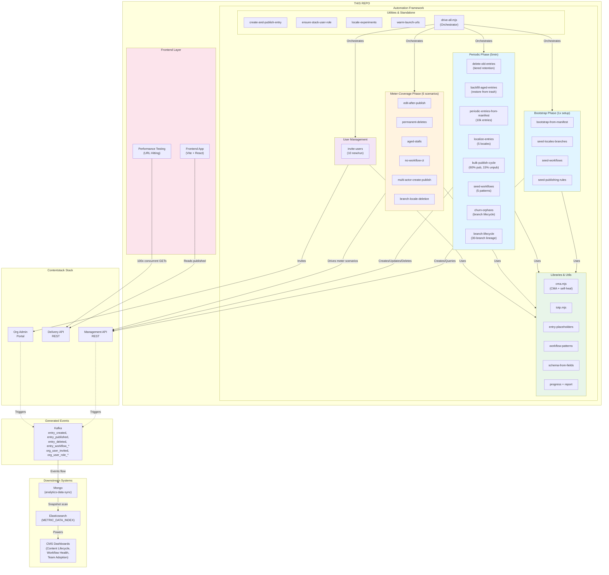
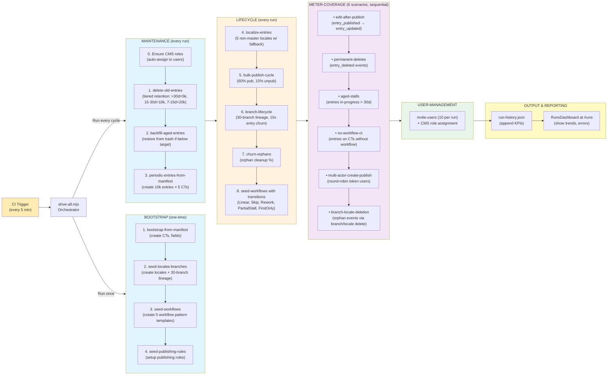
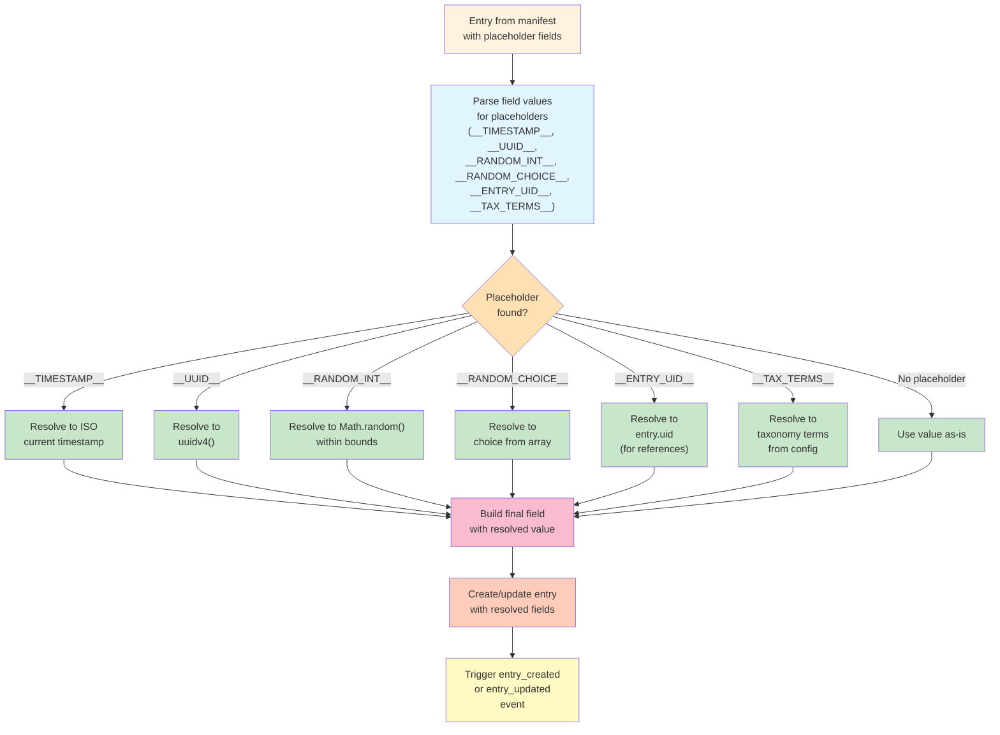
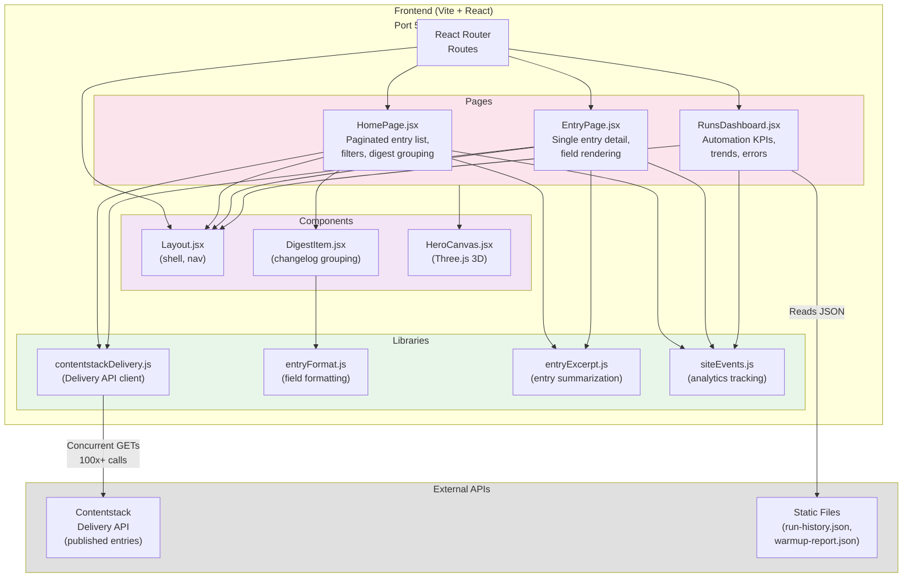
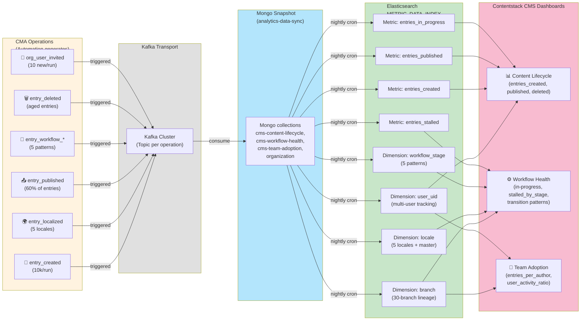

# Contentstack Analytics Testing & Automation Lab

**Comprehensive full-stack platform for testing Contentstack's content delivery, analytics metering, lifecycle automation, multi-user simulation, and advanced meter coverage testing.**

> This is a full-stack testing laboratory for Contentstack that covers the ENTIRE content lifecycle: from creation through metering to analytics validation. It includes frontend app (Vite + React), performance testing (URL warming/hitting), automation framework (24+ scripts), multi-user simulation, TOTP/2FA auth, entry templating, locale experiments, and all meter dimensions.

---

## Table of Contents

1. [Project Overview](#project-overview)
2. [What's Included](#whats-included)
3. [Quick Start](#quick-start)
4. [Team Onboarding](#team-onboarding)
5. [Core Architecture](#core-architecture)
6. [Frontend Application](#frontend-application)
7. [Performance Testing](#performance-testing)
8. [Automation Framework](#automation-framework)
9. [Advanced Features](#advanced-features)
10. [All 24+ Scripts Reference](#all-24-scripts-reference)
11. [Configuration Reference](#configuration-reference)
12. [All npm Commands](#all-npm-commands)
13. [Libraries & Utilities](#libraries--utilities)
14. [UI Components](#ui-components)
15. [Self-Healing Logic](#self-healing-logic)
16. [Monitoring & Analytics](#monitoring--analytics)
17. [CI/CD Integration](#cicd-integration)
18. [Low-Level Design & Algorithms](#low-level-design--algorithms)
19. [Project Structure](#project-structure)
20. [Troubleshooting](#troubleshooting)

---

## Project Overview

### Purpose

This project is a **full-stack testing and automation laboratory** for Contentstack that validates:

- **Content Delivery:** Published entries served via Delivery API (frontend app)
- **Performance:** Launch site warmup and URL hitting for cache/perf testing
- **Analytics Metering:** CMA operations drive meter events that feed analytics dashboards
- **Meter Coverage:** ALL meter dimensions tested (users, branches, locales, workflows, stages, deletions)
- **Lifecycle Simulation:** Realistic content patterns (aging, branching, multi-user, orphaning)
- **Multi-User Scenarios:** Round-robin automation across multiple users
- **Advanced Auth:** TOTP/2FA support for restricted accounts
- **Entry Templating:** Dynamic field value generation via placeholders
- **Locale Experiments:** Destructive testing framework for fallback chains

### The Problem

Analytics dashboards (CMS Content Lifecycle, Workflow Health, Team Adoption) depend on accurate meter events from Contentstack CMA operations. Current testing is shallow:

- ❌ Only fresh entries (no aged data)
- ❌ Single user (no multi-user dimensions)
- ❌ No branching (no lineage events)
- ❌ No deletions (no deletion metering)
- ❌ No orphaning scenarios (no cleanup validation)
- ❌ Manual setup required (content types, locales, workflows)
- ❌ No multi-user testing
- ❌ No locale fallback validation
- ❌ No entry templating

### The Solution

Three integrated components:

1. **Frontend App** — Vite + React displaying published entries from Delivery API with digest/changelog UI and 3D hero
2. **Performance Testing** — Cache warming, URL hitting, concurrent Delivery API testing
3. **Automation Framework** — CMA lifecycle automation driving ALL meter dimensions with 24+ scripts, multi-user simulation, locale experiments, TOTP/2FA support, entry templating, and self-healing

Together they create a **production-grade testing environment** running continuously (every 5 minutes in CI) to generate comprehensive meter events for analytics validation.

---

## What's Included

**The Ultimate Content Lifecycle Testing & Automation Laboratory**

### Complete Feature Inventory

```mermaid
graph TB
    ROOT["🚀 CONTENTSTACK ANALYTICS LAB<br/>Full-Stack Testing & Automation<br/>24+ Scripts | 6 Advanced Features<br/>Complete Meter Coverage"]
    
    subgraph FRONTEND["🎨 FRONTEND (Vite + React)<br/>Published Content Delivery"]
        subgraph FE_PAGES["📄 Pages"]
            FE_HOME["HomePage<br/>• Entry listing with pagination<br/>• Unified digest/changelog UI<br/>• Filtering & search<br/>• Responsive grid layout"]
            FE_ENTRY["EntryPage<br/>• Single entry detail view<br/>• Field rendering<br/>• Markdown support<br/>• Reference expansion<br/>• Per-entry route: /entry/:ct/:uid"]
            FE_DASH["RunsDashboard<br/>• Automation KPI tracking<br/>• Real-time trend charts<br/>• Error log viewer<br/>• Success rate metrics<br/>• Per-step breakdown"]
        end
        
        subgraph FE_COMPONENTS["⚙️ React Components"]
            FE_LAYOUT["Layout.jsx<br/>• App shell & navigation<br/>• Header with refresh<br/>• Footer with metadata<br/>• Dark/light mode"]
            FE_DIGEST["DigestItem.jsx<br/>• Changelog grouping<br/>• Entry metadata<br/>• Timestamp display<br/>• Filter tags"]
            FE_HERO["HeroCanvas.jsx<br/>• Three.js 3D scene<br/>• React Three Fiber<br/>• Responsive rendering<br/>• Interactive controls"]
        end
        
        subgraph FE_LIBS["📚 Frontend Libraries"]
            FE_DELIVERY["contentstackDelivery.js<br/>• Delivery API client<br/>• Concurrent GETs<br/>• Cache headers<br/>• 100x+ parallel requests<br/>• Branch support"]
            FE_FORMAT["entryFormat.js<br/>• Field formatting<br/>• Type conversion<br/>• Date/time display<br/>• Rich text parsing"]
            FE_EXCERPT["entryExcerpt.js<br/>• Text summarization<br/>• Preview generation<br/>• Word limit handling"]
            FE_EVENTS["siteEvents.js<br/>• Analytics tracking<br/>• Event logging<br/>• User interaction monitoring"]
        end
        
        subgraph FE_FEATURES["✨ Frontend Features"]
            FE_F1["✅ Per-entry routes with dynamic params<br/>✅ Unified digest UI with grouping<br/>✅ 100x+ concurrent Delivery API calls<br/>✅ Three.js 3D hero visualization<br/>✅ Branch-aware URLs<br/>✅ Header refresh without page reload<br/>✅ Responsive mobile design<br/>✅ Markdown field rendering<br/>✅ Reference field expansion<br/>✅ Group/block field rendering"]
        end
    end
    
    subgraph PERF["⚡ PERFORMANCE TESTING<br/>Cache Warming & Load Testing"]
        subgraph PERF_TYPES["📊 Testing Modes"]
            PERF_LAUNCH["Launch Site Warming<br/>• Cache priming<br/>• Site availability check<br/>• Warmup metrics"]
            PERF_DELIVERY["Delivery API Hitting<br/>• 100x concurrent GETs<br/>• Entry list endpoint<br/>• Single-entry endpoint<br/>• Cache hit/miss tracking"]
            PERF_CONCURRENT["Concurrent Testing<br/>• Parallel request handling<br/>• Response time tracking<br/>• p50/p95/p99 metrics"]
        end
        
        subgraph PERF_METRICS["📈 Metrics Tracked"]
            PERF_M1["Response Times<br/>• Average latency<br/>• Percentile buckets<br/>• Time per endpoint"]
            PERF_M2["Cache Performance<br/>• Cache hits<br/>• Cache misses<br/>• Hit ratio %"]
            PERF_M3["Availability<br/>• Success rate<br/>• Error counts<br/>• Status codes"]
        end
        
        subgraph PERF_OUTPUT["📁 Reports Generated"]
            PERF_O1["public/warmup-report.json<br/>• Aggregated stats<br/>• Per-endpoint breakdown<br/>• Cache metrics<br/>• Timing percentiles"]
            PERF_O2["Console Logs<br/>• Real-time counts<br/>• Status codes<br/>• Cache hit summaries"]
        end
    end
    
    subgraph AUTO["🤖 AUTOMATION FRAMEWORK<br/>24+ Scripts | All Meter Dimensions"]
        subgraph AUTO_ORCH["🎯 Orchestration"]
            AUTO_ORCH_SCRIPT["drive-all.mjs<br/>• Phase controller<br/>• Mode selector<br/>• Error handling<br/>• Report aggregation"]
        end
        
        subgraph AUTO_BOOTSTRAP["🔧 Bootstrap (1x Setup) [4 Scripts]"]
            AUTO_B1["1️⃣ bootstrap-from-manifest.mjs<br/>• Create content types<br/>• Define fields<br/>• Set field validations<br/>• Enable features"]
            AUTO_B2["2️⃣ seed-locales-branches.mjs<br/>• Create 5 locales<br/>• Setup fallback chains<br/>• Create 30-branch lineage<br/>• Master → Deep nesting"]
            AUTO_B3["3️⃣ seed-workflows.mjs<br/>• Create workflow definitions<br/>• Define 5-stage patterns<br/>• Setup transitions<br/>• Assign to CTs"]
            AUTO_B4["4️⃣ seed-publishing-rules.mjs<br/>• Configure publish rules<br/>• Set environment targets<br/>• Enable/disable rules"]
        end
        
        subgraph AUTO_PERIODIC["📅 Periodic (Every 5min) [8 Scripts]"]
            AUTO_P1["1️⃣ delete-old-entries.mjs<br/>• Tiered retention logic<br/>• >30d: keep 5k<br/>• 15-30d: keep 10k<br/>• 7-15d: keep 20k<br/>• Delete oldest first"]
            AUTO_P2["2️⃣ backfill-aged-entries.mjs<br/>• Restore from trash<br/>• If count < target<br/>• Preserve created_at<br/>• Maintain aged status"]
            AUTO_P3["3️⃣ periodic-entries-from-manifest.mjs<br/>• Create 10,000 entries/run<br/>• All content types<br/>• Random field values<br/>• Track creation KPIs"]
            AUTO_P4["4️⃣ localize-entries.mjs<br/>• 5 non-master locales<br/>• Fallback chains<br/>• Auto-create missing<br/>• entry_created x5 events"]
            AUTO_P5["5️⃣ bulk-publish-cycle.mjs<br/>• Publish 60% of entries<br/>• Unpublish 15%<br/>• Keep 25% unpublished<br/>• entry_published events"]
            AUTO_P6["6️⃣ seed-workflows.mjs (Periodic)<br/>• Existing workflow reuse<br/>• Apply to new entries<br/>• Assign to all CTs<br/>• Enable transitions"]
            AUTO_P7["7️⃣ churn-orphans.mjs<br/>• Clean orphaned entries<br/>• Percentage-based<br/>• Selective deletion<br/>• Preserve data for analytics"]
            AUTO_P8["8️⃣ branch-lifecycle.mjs<br/>• 30-branch lineage<br/>• 10x entry creation/branch<br/>• No teardown<br/>• Data persistence"]
        end
        
        subgraph AUTO_METER["🎯 Meter-Coverage (6 Scenarios)"]
            AUTO_M1["📝 edit-after-publish<br/>• Create entry<br/>• Publish it<br/>• Edit published entry<br/>• Trigger in-progress metric"]
            AUTO_M2["🗑️ permanent-deletes<br/>• Identify entries<br/>• Soft delete<br/>• Hard delete<br/>• entry_deleted events"]
            AUTO_M3["⏳ aged-stalls<br/>• Create entries<br/>• Transition to stage<br/>• Keep > 30 days<br/>• stalled_by_stage metric"]
            AUTO_M4["❌ no-workflow-ct<br/>• Create CT without workflow<br/>• Add entries<br/>• No transitions<br/>• entries_without_workflow metric"]
            AUTO_M5["👥 multi-actor-create-publish<br/>• Round-robin tokens<br/>• Multiple user_uid<br/>• Create & publish<br/>• user_uid dimension"]
            AUTO_M6["🔗 branch-locale-deletion<br/>• Create branch + locale<br/>• Delete branch<br/>• Delete locale<br/>• Orphan cleanup events"]
        end
        
        subgraph AUTO_USERS["👤 User Management [1 Script]"]
            AUTO_U1["invite-users.mjs<br/>• Invite 10 users/run<br/>• Org admin portal<br/>• Playwright automation<br/>• Auto-accept logic<br/>• CMS role assignment"]
        end
        
        subgraph AUTO_UTILS["🛠️ Utilities & Standalone [5 Scripts]"]
            AUTO_UT1["create-and-publish-entry.mjs<br/>• Single entry creation<br/>• Immediate publish<br/>• Used for single tests"]
            AUTO_UT2["ensure-stack-user-role.mjs<br/>• Check CMS roles<br/>• Auto-assign missing<br/>• Via shareStack API"]
            AUTO_UT3["locale-experiments.mjs<br/>• Destructive locale testing<br/>• Create/populate/delete<br/>• Gated by env var"]
            AUTO_UT4["warm-launch-urls.mjs<br/>• Launch site warming<br/>• Concurrent Delivery API<br/>• Cache priming"]
            AUTO_UT5["Additional utils<br/>• Schema validation<br/>• Field generation<br/>• Custom scripts"]
        end
        
        subgraph AUTO_LIBS["📚 Core Libraries (Always Used)"]
            AUTO_LIB1["cma.mjs<br/>• CMA API wrapper<br/>• Rate limiting<br/>• Retry logic<br/>• Self-healing<br/>• Auto-create missing:<br/>  - Locales<br/>  - Workflows<br/>  - User roles"]
            AUTO_LIB2["totp.mjs<br/>• TOTP code generation<br/>• Google Authenticator<br/>• 6-digit codes<br/>• Time-based OTP"]
            AUTO_LIB3["entry-placeholders.mjs<br/>• __TIMESTAMP__<br/>• __UUID__<br/>• __RANDOM_INT__<br/>• __RANDOM_CHOICE__<br/>• __ENTRY_UID__<br/>• __TAX_TERMS__<br/>• Dynamic resolution"]
            AUTO_LIB4["workflow-patterns.mjs<br/>• Linear pattern<br/>• Skip pattern<br/>• Rework pattern<br/>• PartialStall pattern<br/>• FirstOnly pattern<br/>• Weighted distribution"]
            AUTO_LIB5["schema-from-fields.mjs<br/>• Auto-generate schema<br/>• Field definitions<br/>• Validation rules"]
            AUTO_LIB6["progress.mjs + report.mjs<br/>• Progress tracking<br/>• KPI aggregation<br/>• Report generation<br/>• JSON output"]
        end
    end
    
    subgraph ADVANCED["✨ ADVANCED FEATURES"]
        subgraph ADV_MULTIUSER["👥 Multi-User Simulation"]
            ADV_MU1["Round-Robin Tokens<br/>• CONTENTSTACK_MANAGEMENT_TOKENS<br/>• CSV list of tokens<br/>• Cycle through tokens<br/>• Distinct user_uid per request<br/>• Parallel execution"]
            ADV_MU2["Use Cases<br/>• Multi-actor workflows<br/>• User dimension tracking<br/>• Concurrent operations<br/>• Realistic team scenarios"]
        end
        
        subgraph ADV_AUTH["🔐 Authentication (4 Paths)"]
            ADV_AUTH1["1. Cached Authtoken<br/>• Browser session<br/>• Token from login<br/>• Fast reuse"]
            ADV_AUTH2["2. Email + Password<br/>• Direct login<br/>• Session creation<br/>• Workflow transitions"]
            ADV_AUTH3["3. TOTP/2FA<br/>• Google Authenticator<br/>• 6-digit codes<br/>• Time-based OTP<br/>• totp.mjs library"]
            ADV_AUTH4["4. TFA Token<br/>• One-off token<br/>• Bypass 2FA<br/>• Admin override<br/>• Restricted use"]
        end
        
        subgraph ADV_PLACEHOLDER["🏷️ Entry Placeholders"]
            ADV_PH1["Supported Placeholders<br/>• __TIMESTAMP__ → ISO timestamp<br/>• __UUID__ → uuidv4()<br/>• __RANDOM_INT__ → number<br/>• __RANDOM_CHOICE__ → array pick<br/>• __ENTRY_UID__ → entry reference<br/>• __TAX_TERMS__ → taxonomy terms"]
            ADV_PH2["Use Cases<br/>• Dynamic field values<br/>• Reference linking<br/>• Test data generation<br/>• Time-based testing<br/>• Taxonomy assignment"]
        end
        
        subgraph ADV_LOCALE["🌍 Locale Experiments"]
            ADV_LOC1["Destructive Testing<br/>• Create locales<br/>• Populate entries<br/>• Delete locales<br/>• Orphan scenarios<br/>• Fallback chain validation"]
            ADV_LOC2["Gating<br/>• CONTENTSTACK_RUN_LOCALE_EXPERIMENTS=1<br/>• Optional feature<br/>• Off by default<br/>• Safe destructive ops"]
        end
        
        subgraph ADV_WORKFLOW["🔄 Workflow Patterns (5 Types)"]
            ADV_WF1["Pattern Types<br/>• Linear: A→B→C→D→E<br/>• Skip: A→C→E<br/>• Rework: A→B→A→C<br/>• PartialStall: A→B→(stuck)"]
            ADV_WF2["Distribution<br/>• Weighted random selection<br/>• Coverage all patterns<br/>• Realistic transitions<br/>• Stress test workflows"]
        end
    end
    
    subgraph MONITORING["📊 MONITORING & REPORTING"]
        subgraph MON_KPI["📈 KPIs Tracked"]
            MON_K1["Per-Run KPIs<br/>• Entries created<br/>• Entries localized<br/>• Entries published<br/>• Entries deleted<br/>• Workflow transitions<br/>• Users invited<br/>• Scenario success %"]
            MON_K2["Aggregated Metrics<br/>• Run history JSON<br/>• Trend analysis<br/>• Success rate<br/>• Error rate<br/>• Time per phase"]
        end
        
        subgraph MON_DASH["🎯 Dashboard (At /runs)"]
            MON_D1["RunsDashboard Features<br/>• Last 60 runs displayed<br/>• Trend charts<br/>• KPI breakdown<br/>• Color coding:<br/>  - 🟢 95%+ OK<br/>  - 🟡 50-95%<br/>  - 🔴 <50%<br/>• Error log search"]
        end
        
        subgraph MON_OUTPUT["📁 Output Files"]
            MON_O1["public/run-history.json<br/>• Append KPIs per run<br/>• 60+ run history<br/>• Trends tracking<br/>• Failure analysis"]
            MON_O2["public/warmup-report.json<br/>• Perf test results<br/>• Cache metrics<br/>• Response times<br/>• Endpoint breakdown"]
        end
    end
    
    subgraph HEALING["🔧 SELF-HEALING LOGIC<br/>Auto-Create Missing Prerequisites"]
        subgraph HEALING_WHAT["What Gets Auto-Created"]
            HEALING_W1["✅ Missing Locales<br/>• Check if exists<br/>• Create with fallback<br/>• Setup chain<br/>• Then use"]
            HEALING_W2["✅ Missing Workflows<br/>• Check if exists<br/>• Create with defaults<br/>• Define stages<br/>• Assign to CT"]
            HEALING_W3["✅ Missing User Roles<br/>• Check CMS role<br/>• Auto-assign via shareStack<br/>• Grant permissions<br/>• Enable operations"]
        end
        
        subgraph HEALING_WHEN["When It Happens"]
            HEALING_TIME["⏱️ On Demand<br/>• Checked at every script<br/>• Created if missing<br/>• Retried if failed<br/>• Graceful skip if still missing"]
        end
    end
    
    subgraph CICD["🚀 CI/CD INTEGRATION"]
        subgraph CI_SETUP["GitHub Actions"]
            CI_S1["Scheduled Trigger<br/>• Every 5 minutes<br/>• Cron: */5 * * * *<br/>• Manual trigger available"]
            CI_S2["Environment Variables<br/>• CONTENTSTACK_API_KEY<br/>• CONTENTSTACK_MANAGEMENT_TOKEN<br/>• CONTENTSTACK_USER_EMAIL<br/>• CONTENTSTACK_USER_PASSWORD<br/>• CONTENTSTACK_PUBLISH_ENVIRONMENT"]
        end
        
        subgraph CI_EXEC["Execution"]
            CI_E1["npm run automate:drive:ci<br/>• Bootstrap check<br/>• Periodic execution<br/>• Result appending<br/>• Alert on failure"]
        end
    end
    
    ROOT --> FRONTEND
    ROOT --> PERF
    ROOT --> AUTO
    ROOT --> ADVANCED
    ROOT --> MONITORING
    ROOT --> HEALING
    ROOT --> CICD
    
    FRONTEND --> FE_PAGES
    FRONTEND --> FE_COMPONENTS
    FRONTEND --> FE_LIBS
    FRONTEND --> FE_FEATURES
    
    PERF --> PERF_TYPES
    PERF --> PERF_METRICS
    PERF --> PERF_OUTPUT
    
    AUTO --> AUTO_ORCH
    AUTO --> AUTO_BOOTSTRAP
    AUTO --> AUTO_PERIODIC
    AUTO --> AUTO_METER
    AUTO --> AUTO_USERS
    AUTO --> AUTO_UTILS
    AUTO --> AUTO_LIBS
    
    ADVANCED --> ADV_MULTIUSER
    ADVANCED --> ADV_AUTH
    ADVANCED --> ADV_PLACEHOLDER
    ADVANCED --> ADV_LOCALE
    ADVANCED --> ADV_WORKFLOW
    
    MONITORING --> MON_KPI
    MONITORING --> MON_DASH
    MONITORING --> MON_OUTPUT
    
    HEALING --> HEALING_WHAT
    HEALING --> HEALING_WHEN
    
    CICD --> CI_SETUP
    CICD --> CI_EXEC
    
    style ROOT fill:#1a1a2e,stroke:#00d4ff,stroke-width:3px,color:#fff
    style FRONTEND fill:#fce4ec,stroke:#c2185b,stroke-width:2px
    style PERF fill:#e3f2fd,stroke:#1565c0,stroke-width:2px
    style AUTO fill:#f3e5f5,stroke:#6a1b9a,stroke-width:2px
    style ADVANCED fill:#fff3e0,stroke:#e65100,stroke-width:2px
    style MONITORING fill:#e0f2f1,stroke:#00695c,stroke-width:2px
    style HEALING fill:#f1f8e9,stroke:#33691e,stroke-width:2px
    style CICD fill:#fde7e8,stroke:#880e4f,stroke-width:2px
```



### Feature Breakdown by Category

| Category | What's Included | Count |
|----------|-----------------|-------|
| **Frontend Pages** | HomePage, EntryPage, RunsDashboard | 3 |
| **React Components** | Layout, DigestItem, HeroCanvas | 3 |
| **Frontend Libraries** | Delivery API, Formatting, Events tracking | 4 |
| **Automation Scripts** | Bootstrap, Periodic, Meter-coverage, Utilities | 24+ |
| **Advanced Features** | Multi-user, Auth paths, Placeholders, Locale experiments, Workflow patterns | 5 |
| **Core Libraries** | CMA wrapper, TOTP, Placeholders, Patterns, Schema gen, Progress | 6 |
| **KPI Metrics** | Entries created/published/deleted, users, success rate, trends | 15+ |
| **Authentication Methods** | Authtoken, Email+Pwd, TOTP/2FA, TFA token | 4 |
| **Placeholder Types** | Timestamp, UUID, Random int, Random choice, Entry UID, Taxonomy | 6 |
| **Workflow Patterns** | Linear, Skip, Rework, PartialStall, FirstOnly | 5 |
| **Locale Support** | Master + 5 locales, Fallback chains, Experiments | 6+ |
| **Content Types** | Configurable, Multi-branch support, Field validation | N/A |
| **Branches** | 30-branch lineage, No teardown, Full lifecycle | 30 |
| **Meter Dimensions** | User, branch, locale, workflow, stage, lifecycle, orphan | 7+ |
| **Self-Healing** | Auto-create locales, workflows, roles | 3 |
| **Performance Testing** | Warmup, hitting, concurrent, cache tracking | 3 modes |
| **Monitoring** | Dashboard, KPI tracking, Error logging, Report generation | Continuous |
| **CI/CD** | GitHub Actions, 5-min scheduling, Secrets management | Full |

### What Gets Tested (Comprehensive Coverage)

✅ **Entry Lifecycle** — Create, localize, publish, unpublish, update, delete, restore  
✅ **Workflow Transitions** — 5 patterns with weighted distribution  
✅ **Multi-User Scenarios** — Round-robin across multiple users with distinct user_uid  
✅ **Multi-Branch Lineage** — 30-branch tree with cascading content  
✅ **Locale Fallback Chains** — 5 locales with fallback validation  
✅ **Aging & Retention** — Tiered retention, aged entry restoration  
✅ **Orphaning Scenarios** — Branch/locale deletion events  
✅ **Meter Dimensions** — All CMA operation dimensions covered  
✅ **Authentication Paths** — Authtoken, email+pwd, TOTP, TFA  
✅ **Advanced Features** — Placeholders, locale experiments, workflow patterns  
✅ **Performance Testing** — Cache warming, concurrent requests, response times  
✅ **Self-Healing** — Auto-creation of missing prerequisites  
✅ **Multi-Locale Support** — Realistic fallback and inheritance patterns  
✅ **Event Generation** — All meter events for analytics validation  
✅ **Continuous Monitoring** — Dashboard, KPIs, trend tracking

---

## Quick Start

### Frontend App (5 min)

```bash
npm install
cp .env.example .env

# Fill in Delivery API vars:
VITE_CONTENTSTACK_API_KEY=...
VITE_CONTENTSTACK_DELIVERY_TOKEN=...
VITE_CONTENTSTACK_ENVIRONMENT=...
VITE_CONTENTSTACK_DELIVERY_HOST=...

npm run dev  # http://localhost:5173
```

### Automation (Bootstrap + Periodic, 40 min)

```bash
# Fill in CMA vars in .env
CONTENTSTACK_MANAGEMENT_TOKEN=...
CONTENTSTACK_USER_EMAIL=...
CONTENTSTACK_USER_PASSWORD=...
CONTENTSTACK_PUBLISH_ENVIRONMENT=...

# Bootstrap (one-time setup)
npm run automate:drive:bootstrap

# Periodic (10k entries, all meter coverage)
npm run automate:drive

# View dashboard
# Open http://localhost:5173/runs
```

### Performance Testing (5 min)

```bash
npm run warm:launch-urls
# Results: public/warmup-report.json
```

---

## Team Onboarding

### For Frontend Developers

**Goal:** Understand how the React app uses Contentstack Delivery API to list and display published entries.

**Quick Start:**

```bash
# 1. Copy env template
cp .env.example .env

# 2. Fill in Delivery API credentials
VITE_CONTENTSTACK_API_KEY=your_api_key
VITE_CONTENTSTACK_DELIVERY_TOKEN=your_token
VITE_CONTENTSTACK_ENVIRONMENT=production
VITE_CONTENTSTACK_DELIVERY_HOST=https://cdn.contentstack.io

# 3. Start dev server
npm install
npm run dev

# 4. Open http://localhost:5173
# You'll see published entries with digest UI and 3D hero
```

**Key Files:**
- `src/pages/EntryPage.jsx` — Single entry display via route `/entry/:contentTypeUid/:entryUid`
- `src/pages/HomePage.jsx` — Entry listing with pagination and filters
- `src/pages/RunsDashboard.jsx` — Automation KPI dashboard
- `src/components/DigestItem.jsx` — Changelog entry grouping
- `src/components/HeroCanvas.jsx` — Three.js 3D visualization
- `src/components/Layout.jsx` — App shell and navigation
- `src/lib/contentstackDelivery.js` — Delivery API client
- `vite.config.js` — Vite + React setup

**Environment Variables (Frontend):**

| Variable | Purpose | Required |
|----------|---------|----------|
| `VITE_CONTENTSTACK_API_KEY` | Stack API key | Yes |
| `VITE_CONTENTSTACK_DELIVERY_TOKEN` | Delivery API token (read-only) | Yes |
| `VITE_CONTENTSTACK_ENVIRONMENT` | Target environment uid | Yes |
| `VITE_CONTENTSTACK_DELIVERY_HOST` | CDN URL (e.g., `https://cdn.contentstack.io`) | Yes |
| `VITE_CONTENTSTACK_CONTENT_TYPE_UIDS` | CSV of CTs to list | No (defaults to top_url_lines) |
| `VITE_CONTENTSTACK_BRANCH` | Branch (if using branches) | No |

**Features:**
✅ Per-entry routes (`/entry/:contentTypeUid/:entryUid`)  
✅ Unified digest/changelog UI with filters  
✅ Concurrent Delivery API calls  
✅ 3D hero rendering via Three.js  
✅ Branch support in Delivery API URLs  
✅ Header Refresh to reload entries  

---

### For QA/Performance Engineers

**Goal:** Understand how to warm the launch site and test Delivery API performance.

**Quick Start:**

```bash
# 1. Set env vars
export VITE_CONTENTSTACK_CONTENT_TYPE_UIDS=demo_plain_text,demo_json_rte
export LAUNCH_SITE_URL=https://yoursite.com
export APP_DELIVERY_HOST=https://cdn.contentstack.io

# 2. Run warmup
npm run warm:launch-urls

# 3. Check results
cat public/warmup-report.json
```

**Scripts:**
- `npm run warm:launch-urls` — Warms Launch site + concurrent Delivery API hits
- Results logged to console + `public/warmup-report.json`

**What It Tests:**
- Delivery API response time
- Cache hit/miss headers
- Entry list endpoint (100x concurrent GETs)
- Single-entry endpoint (100x concurrent GETs)
- Launch site availability

---

### For Automation Engineers

**Goal:** Understand CMA automation, meter coverage, self-healing, and advanced features.

**Quick Start:**

```bash
# 1. Set all CMA + automation vars in .env
cp .env.example .env
# Fill in: CONTENTSTACK_API_KEY, CONTENTSTACK_MANAGEMENT_TOKEN, 
#          CONTENTSTACK_USER_EMAIL, CONTENTSTACK_USER_PASSWORD, etc.

# 2. Bootstrap (one-time: create CTs, locales, workflows, branches)
npm run automate:drive:bootstrap

# 3. Run periodic (10k entries, all meter coverage)
npm run automate:drive

# 4. Monitor dashboard
# Open http://localhost:5173/runs (shows KPIs, success rate, trends)

# 5. Check run history
jq '.[-5:]' public/run-history.json
```

**Key Concepts:**
- **Self-healing:** Automation auto-creates missing locales, workflows, user roles (no manual setup)
- **Meter coverage:** 6 scenarios testing all dimension combinations
- **Data preservation:** No teardown — aged data kept for analytics
- **Volume:** 10,000 entries/run × 5 locales × multiple CTs = 250,000+ events/run
- **Multi-user:** Round-robin simulation across multiple management tokens
- **Advanced auth:** Support for TOTP/2FA via Google Authenticator algorithm
- **Entry templating:** Dynamic field values using __TIMESTAMP__, __UUID__, etc.
- **Locale experiments:** Destructive testing of fallback chains (optional, gated)

**Key Files:**
- `scripts/drive-all.mjs` — Orchestrator (bootstrap/periodic/full modes)
- `scripts/lib/cma.mjs` — CMA helpers + self-healing logic
- `scripts/` — 24+ specialized scripts (see All Scripts Reference)

---

### For Analytics/Data Engineers

**Goal:** Understand meter event generation and coverage validation.

**Key Points:**
- Automation creates realistic content patterns (branching, locales, workflows, aging, orphaning)
- Every CMA operation triggers events (entry_created, entry_published, entry_workflow_*, etc.)
- This repo GENERATES comprehensive meter events; downstream systems (analytics-data-sync, Kafka, ES) consume them
- We ensure all meter dimensions are covered; downstream dashboards are fed by this data

**Meter Coverage (What Gets Tested):**

| Meter | Dimension | Driver | Tested |
|-------|-----------|--------|--------|
| entries_created | locale | localize-entries.mjs | ✅ 5 locales × 10k |
| entries_created | content_type | periodic-entries.mjs | ✅ All CTs |
| entries_created | branch | branch-lifecycle.mjs | ✅ 30-branch lineage |
| entries_published | user_uid | multi-actor.mjs | ✅ 2+ users |
| entries_in_progress | — | edit-after-publish.mjs | ✅ Scenario |
| entries_deleted | — | permanent-deletes.mjs | ✅ Scenario |
| entries_without_workflow | — | no-workflow-ct.mjs | ✅ Scenario |
| stalled_by_stage | workflow_uid | aged-stalls.mjs | ✅ 5+ stages |
| snapshot (branch axis) | branch_uid | branch-lifecycle.mjs | ✅ Orphan |
| snapshot (locale axis) | locale_code | branch-locale-deletion.mjs | ✅ Orphan |
| org_users | — | invite-users.mjs | ✅ 10/run |

**Verification:**
- Check `public/run-history.json` for per-run KPIs
- Monitor dashboard at `/runs` for trends
- Verify CMA operations succeeded via run-history.json success rate
- Confirm all meter dimensions covered in KPIs

---

### For DevOps/Infrastructure

**Goal:** Deploy automation to CI, manage secrets, monitor health.

**CI Setup (GitHub Actions):**

```yaml
name: Periodic Automation

on:
  schedule:
    - cron: '*/5 * * * *'  # Every 5 minutes
  workflow_dispatch:        # Manual trigger

jobs:
  periodic:
    runs-on: ubuntu-latest
    steps:
      - uses: actions/checkout@v4
      - uses: actions/setup-node@v4
        with:
          node-version: 24
      
      - run: npm ci
      - run: npm run automate:drive:ci -- --mode periodic
        env:
          CONTENTSTACK_API_KEY: ${{ secrets.CONTENTSTACK_API_KEY }}
          CONTENTSTACK_MANAGEMENT_TOKEN: ${{ secrets.CONTENTSTACK_MANAGEMENT_TOKEN }}
          CONTENTSTACK_PUBLISH_ENVIRONMENT: production
          CONTENTSTACK_USER_EMAIL: ${{ secrets.CONTENTSTACK_USER_EMAIL }}
          CONTENTSTACK_USER_PASSWORD: ${{ secrets.CONTENTSTACK_USER_PASSWORD }}
```

**Secrets to Configure (GitHub → Settings → Secrets and variables → Actions):**
- `CONTENTSTACK_API_KEY`
- `CONTENTSTACK_MANAGEMENT_TOKEN`
- `CONTENTSTACK_PUBLISH_ENVIRONMENT`
- `CONTENTSTACK_USER_EMAIL`
- `CONTENTSTACK_USER_PASSWORD`

**Monitoring:**
- Dashboard at `/runs` shows 95%+ success rate, KPI trends
- Run history appended to `public/run-history.json`
- Alert if > 5% step failures in rolling 24h window

---

## Core Architecture

### System Flow & Architecture

#### 1. High-Level System Architecture



#### 2. Complete Automation Workflow & Dependencies



#### 3. Entry Placeholder Resolution Flow (LLD)



#### 4. Frontend Integration & React Component Architecture



#### 5. Complete Data Flow: CMA Operation → Events → Analytics Dashboard



---

## Frontend Application

### Routes & Features

| Route | Purpose | Features |
|-------|---------|----------|
| `/` | Home/Entry list | Unified feed, filters, pagination, 3D hero |
| `/entry/:ct/:uid` | Single entry display | Detail view, formatted fields, markdown |
| `/runs` | Automation dashboard | KPIs, success rates, trends, error logs |

### Components

- **EntryPage** — Single entry with fields, markdown rendering, reference expansion
- **HomePage** — Paginated list, filtering, search, digest grouping
- **RunsDashboard** — Real-time KPI tracking, trends, failure logs
- **DigestItem** — Changelog entries with grouping and filters
- **HeroCanvas** — Three.js 3D visualization (React Three Fiber)
- **Layout** — App shell with navigation

### Features

✅ Per-entry routes (`/entry/:contentTypeUid/:entryUid`)  
✅ Unified digest/changelog UI with filters  
✅ Concurrent Delivery API calls (100x+)  
✅ 3D hero rendering via Three.js  
✅ Branch support in Delivery API URLs  
✅ Header Refresh to reload entries  
✅ Markdown field rendering  
✅ Reference field expansion  
✅ Group/block field rendering  

---

## Performance Testing

### URL Hitting & Warmup

**Feature:** Warm cache and test Delivery API performance concurrently.

```bash
npm run warm:launch-urls
```

**What Gets Tested:**
- Delivery API entry list endpoint (100x concurrent requests)
- Single-entry endpoint (100x concurrent requests)
- Cache hit/miss headers
- Response time percentiles (p50, p95, p99)
- Launch site availability

**Reports:**
- **Console:** Real-time request counts, status codes, cache hits
- **public/warmup-report.json:** Aggregated stats (avg time, p95, cache hits, failures)

---

## Automation Framework

### All 24+ Scripts

**[See "All 24+ Scripts Reference" section below for complete list]**

---

## Advanced Features

### 1. Multi-User Simulation

**Round-robin actions across multiple management tokens:**

```bash
CONTENTSTACK_MANAGEMENT_TOKENS=token1,token2,token3
```

Effects:
- Rotate through tokens for each CMA request
- Each request carries token owner's user_uid in metering events
- Drives `entries_published.user_uid` distinct dimension
- Tests multi-author scenarios without needing separate user credentials

---

### 2. Authentication: 4 Paths for Workflow Transitions

**Management tokens CANNOT change workflow stages. Four auth paths available:**

**Path 1: Cached Authtoken (Fastest)**
```bash
CONTENTSTACK_USER_AUTHTOKEN=<long-lived token>
```
- Skips login entirely
- Valid for weeks
- Get from: Browser DevTools → Application → Cookies → `authtoken`
- Or: One-off interactive login

**Path 2: Email + Password + TOTP (2FA)**
```bash
CONTENTSTACK_USER_EMAIL=user@example.com
CONTENTSTACK_USER_PASSWORD=password
CONTENTSTACK_USER_TOTP_SECRET=JBSWY3DPEHPK3PXP
```
- Computes rotating 6-digit code using Google Authenticator algorithm
- No external dependencies (uses Node.js built-in crypto)
- To obtain TOTP secret:
  1. Contentstack UI → User Settings → Security → Two-Factor Auth
  2. Disable 2FA if enabled
  3. Re-enable 2FA → QR code appears
  4. Click "Can't scan? / Show key" to reveal base32 secret
  5. Copy before completing setup
  6. Add to authenticator app AND to .env

**Path 3: Email + Password (No 2FA)**
```bash
CONTENTSTACK_USER_EMAIL=user@example.com
CONTENTSTACK_USER_PASSWORD=password
```
- Fails if 2FA is enabled on account
- Only for accounts without 2FA

**Path 4: One-Off Interactive (Manual)**
```bash
CONTENTSTACK_USER_EMAIL=user@example.com
CONTENTSTACK_USER_PASSWORD=password
CONTENTSTACK_USER_TFA_TOKEN=123456
```
- Use current 6-digit code (~30s valid)
- Only for manual testing

---

### 3. Entry Placeholders & Templating

**Dynamic field value generation using templates:**

Supported placeholders:
- `__TIMESTAMP__` → Unix timestamp
- `__UUID__` → Random UUID v4
- `__RANDOM_INT(min,max)__` → Random integer
- `__RANDOM_CHOICE(a,b,c)__` → Pick from list
- `__ENTRY_UID__` → Current entry UID
- `__TAX_TERMS_*__` → Taxonomy term mapping

Usage in manifest:
```json
{
  "title": "Entry __TIMESTAMP__",
  "id": "__UUID__",
  "score": "__RANDOM_INT(1,100)__",
  "category": "__RANDOM_CHOICE(a,b,c)__"
}
```

---

### 4. Locale Experiments (Destructive Testing)

**Test locale fallback chains and orphaning scenarios:**

```bash
# Enable and run (never runs in normal cron)
CONTENTSTACK_RUN_LOCALE_EXPERIMENTS=1 npm run automate:locale-experiments
```

**What It Does:**
1. Create locales specified in manifest
2. Populate with entries
3. Delete locales (creates orphans)
4. Verify orphaning events
5. Optionally recreate locales

**Manifest:** `scripts/locale-experiments.manifest.json`

**Events Driven:** `entries_orphaned_by_locale_deleted`

**WARNING:** Destructive — deletes entries and locales. Must be explicitly enabled.

---

### 5. Workflow Patterns (5 Types)

**Test different workflow transition scenarios:**

| Pattern | Flow | Use Case | Weight |
|---------|------|----------|--------|
| **Linear** | [0→1→2] | Standard: Draft → Review → Approved | 30% |
| **Skip** | [0→2] | Fast-track: Draft → Approved | 10% |
| **Rework** | [0→1→0→1→2] | Revisions: Send back then forward | 20% |
| **PartialStall** | [0→1] | Stuck in middle: Draft → Review (no progress) | 20% |
| **FirstOnly** | [0] | No transition: Stays in Draft | 20% |

---

## All 24+ Scripts Reference

### Orchestration

| Script | Purpose | Mode |
|--------|---------|------|
| `drive-all.mjs` | Master orchestrator | bootstrap/periodic/full |

### Bootstrap Phase (Foundation)

| Script | Purpose | Triggers |
|--------|---------|----------|
| `bootstrap-from-manifest.mjs` | Create content types from manifest | One-time |
| `seed-locales-branches.mjs` | Create locales (with fallback) + branches | One-time |
| `seed-workflows.mjs` | Create workflows + stages | One-time |
| `seed-publishing-rules.mjs` | Create publish rules for workflows | One-time |

### Periodic Phase (Lifecycle)

| Script | Purpose | Volume |
|--------|---------|--------|
| `delete-old-entries.mjs` | Tiered retention (3 age bands) | 3-10k |
| `backfill-aged-entries.mjs` | Restore from trash if below targets | 0-2k |
| `periodic-entries-from-manifest.mjs` | Bulk create entries (concurrent) | 10,000 |
| `localize-entries.mjs` | Multi-locale (auto-create missing) | 50,000 |
| `bulk-publish-cycle.mjs` | Publish/unpublish cycle | 6,000 |
| `seed-workflows.mjs` | Transition entries (5 patterns) | 2,000 |
| `churn-orphans.mjs` | Edge cases (disable, detach, restore) | variable |
| `branch-lifecycle.mjs` | 30-branch lineage + dynamic CTs | variable |

### Meter-Coverage Scenarios (6x)

| Script | Meter | Purpose |
|--------|-------|---------|
| `edit-after-publish.mjs` | entries_in_progress | Publish → edit |
| `permanent-deletes.mjs` | entries_deleted | Hard delete |
| `aged-stalls.mjs` | stalled_by_stage | Mid-stage stalls |
| `no-workflow-ct.mjs` | entries_without_workflow | Bare CT |
| `multi-actor-create-publish.mjs` | entries_published.user_uid | 2 users |
| `branch-locale-deletion.mjs` | snapshot orphan axes | Branch/locale delete |

### User Management

| Script | Purpose | Method |
|--------|---------|--------|
| `invite-users.mjs` | Invite 10 users + assign CMS roles | Playwright UI automation |

### Standalone/One-Off

| Script | Purpose | Trigger |
|--------|---------|---------|
| `create-and-publish-entry.mjs` | Create and publish single entry | `npm run automate:entry` |
| `ensure-stack-user-role.mjs` | Ensure user has CMS role | `npm run automate:ensure-role` |
| `locale-experiments.mjs` | Destructive locale testing | `npm run automate:locale-experiments` |
| `warm-launch-urls.mjs` | Warm Delivery API cache | `npm run warm:launch-urls` |

---

## Configuration Reference

### Complete .env Options

**[See .env.example for all 60+ options with detailed comments]**

---

## All npm Commands

### Development

```bash
npm run dev              # Start frontend dev server
npm run build            # Build for production
npm run preview          # Preview prod build
npm run lint             # ESLint check
```

### Automation: Phases (Individual)

```bash
npm run automate:manifest              # Bootstrap: create CTs
npm run automate:locales-branches      # Bootstrap: create locales + branches
npm run automate:workflows             # Bootstrap: create workflows
npm run automate:publishing-rules       # Bootstrap: create publish rules
npm run automate:delete                # Periodic: delete old entries
npm run automate:entries:periodic      # Periodic: create 10k entries
npm run automate:entries:periodic:ci   # Periodic: CI mode
npm run automate:localize              # Periodic: localize entries
npm run automate:bulk-publish          # Periodic: publish/unpublish
npm run automate:churn                 # Periodic: edge cases
```

### Automation: Orchestration

```bash
npm run automate:drive                 # Full periodic (all phases)
npm run automate:drive:bootstrap       # Bootstrap only
npm run automate:drive:full            # Bootstrap + periodic
npm run automate:drive:ci              # CI-mode periodic
```

### Automation: Utilities

```bash
npm run automate:entry                 # Create single entry
npm run automate:ensure-role           # Ensure user has CMS role
npm run automate:locale-experiments    # Run destructive locale tests
```

### Performance Testing

```bash
npm run warm:launch-urls               # Warm cache, test Delivery API
```

---

## Libraries & Utilities

### CMA Helpers (lib/cma.mjs)

Core functions:
- `loadStackAuth()` — Parse auth from .env
- `headersForToken()` — Build CMA headers
- `createEntry()` — Create with self-healing
- `listLocales()` — List locales
- `createLocale()` — Auto-create if missing
- `transitionEntryWorkflow()` — Transition with user session
- `ensureUserHasCMSRole()` — Auto-assign role
- `ensureWorkflowExists()` — Auto-create workflow
- `ensureContentTypeExists()` — Auto-create CT

### Advanced Libraries

**lib/totp.mjs:** TOTP code generation (Google Authenticator compatible, no external deps)

**lib/entry-placeholders.mjs:** Template expansion (__TIMESTAMP__, __UUID__, __RANDOM_*, __TAX_TERMS__)

**lib/schema-from-fields.mjs:** Auto-generate schema from field definitions

**lib/workflow-patterns.mjs:** 5 transition pattern types with weighted distribution

**lib/progress.mjs:** Concurrent task tracking, real-time progress logging

**lib/report.mjs:** Per-step KPI collection, run-history append

### Frontend Libraries

**lib/contentstackDelivery.js:** Delivery API client

**lib/entryExcerpt.js:** Excerpt generation from rich content

**lib/entryFormat.js:** Field formatting for display

**lib/siteEvents.js:** Event tracking and analytics

---

## UI Components

| Component | Purpose | Features |
|-----------|---------|----------|
| **EntryPage** | Single entry rendering | Markdown, references, groups |
| **HomePage** | Entry listing | Pagination, filters, digest |
| **RunsDashboard** | KPI dashboard | Trends, errors, success rate |
| **DigestItem** | Changelog entry | Grouping, filtering |
| **HeroCanvas** | 3D visualization | Three.js, responsive |
| **Layout** | App shell | Navigation, state |

---

## Self-Healing Logic

**The automation detects and fixes missing prerequisites:**

| Problem | Auto-Fix | Result |
|---------|----------|--------|
| Locale missing | Create with fallback chain | Localization succeeds |
| Workflow missing | Create with default stages | Transitions work |
| User lacks CMS role | Assign via shareStack | User can operate |
| Content type missing | Create from manifest | Entries created |
| No trashed entries | Skip backfill gracefully | No error |

---

## Monitoring & Analytics

### Dashboard (`/runs`)

Real-time automation KPIs:

**Reliability:**
- Success rate per run (aim: 95%+)
- Green streaks (consecutive successes)
- p95 run duration

**Entries:**
- Created, deleted, localized counts
- Per-age-band retention
- Net entry growth

**Meter Coverage:**
- Per-scenario KPI tracking
- Dimension coverage matrix

**Errors:**
- Failure log with root cause
- Missing dimensions
- Step-by-step tracking

### Run History

KPIs appended to `public/run-history.json` after each run:
- Timestamp, mode
- Per-step planned/actual/failed counts
- Aggregated KPIs
- Error audit log

---

## CI/CD Integration

[See above for GitHub Actions setup]

---

## Low-Level Design & Algorithms

### Entry Creation with Concurrency

- Batch creation with configurable concurrency (default 12)
- Graceful handling of org entry cap (133 error)
- Progress tracking per content type

### Tiered Retention Algorithm

- 3 age bands: >30d (keep 5k), 15-30d (keep 10k), 7-15d (keep 20k)
- Delete oldest excess per band
- Bounded growth while maintaining aged dataset

### Backfill from Trash

- Restore trashed entries if band falls below target
- Preserve original created_at timestamp
- Maintain "aged" status for analytics

### Workflow Transitions with 5 Patterns

- Linear, Skip, Rework, PartialStall, FirstOnly
- Weighted distribution (30%, 10%, 20%, 20%, 20%)
- Per-stage error handling

---

## Project Structure

```
/
├── src/                          # Frontend + utilities
│   ├── pages/
│   │   ├── EntryPage.jsx         # Single entry display
│   │   ├── HomePage.jsx          # Entry listing
│   │   └── RunsDashboard.jsx     # KPI dashboard
│   ├── components/
│   │   ├── DigestItem.jsx        # Changelog
│   │   ├── HeroCanvas.jsx        # Three.js
│   │   └── Layout.jsx            # App shell
│   ├── lib/
│   │   ├── contentstackDelivery.js   # Delivery API
│   │   ├── entryExcerpt.js           # Excerpts
│   │   ├── entryFormat.js            # Formatting
│   │   └── siteEvents.js             # Events
│   └── App.jsx, main.jsx
│
├── scripts/                       # Automation (24+ scripts)
│   ├── drive-all.mjs              # Orchestrator
│   ├── bootstrap-*.mjs (4)         # Bootstrap phase
│   ├── delete-old-entries.mjs
│   ├── backfill-aged-entries.mjs
│   ├── periodic-entries-from-manifest.mjs
│   ├── localize-entries.mjs
│   ├── bulk-publish-cycle.mjs
│   ├── seed-workflows.mjs
│   ├── churn-orphans.mjs
│   ├── branch-lifecycle.mjs
│   ├── edit-after-publish.mjs
│   ├── permanent-deletes.mjs
│   ├── aged-stalls.mjs
│   ├── no-workflow-ct.mjs
│   ├── multi-actor-create-publish.mjs
│   ├── branch-locale-deletion.mjs
│   ├── invite-users.mjs
│   ├── create-and-publish-entry.mjs
│   ├── ensure-stack-user-role.mjs
│   ├── locale-experiments.mjs
│   ├── warm-launch-urls.mjs
│   ├── lib/
│   │   ├── cma.mjs               # CMA helpers + self-healing
│   │   ├── totp.mjs              # TOTP code generation
│   │   ├── entry-placeholders.mjs    # Template expansion
│   │   ├── schema-from-fields.mjs    # Schema generation
│   │   ├── workflow-patterns.mjs     # Transition patterns
│   │   ├── progress.mjs          # Progress tracking
│   │   └── report.mjs            # KPI reporting
│   └── manifests/                # Config files
│       ├── content-types.manifest.json
│       ├── workflows.manifest.json
│       ├── locales-branches.manifest.json
│       ├── locale-experiments.manifest.json
│       └── publishing-rules.manifest.json
│
├── public/
│   ├── run-history.json          # Automation KPI history
│   └── warmup-report.json        # Performance report
│
├── .env.example                  # Environment template (60+ options)
├── package.json                  # Scripts + deps
└── README.md                     # This file
```

---

## Troubleshooting

| Error | Cause | Solution |
|-------|-------|----------|
| "Language not found (422)" | Missing locale | Auto-created on next run |
| "Workflow not found" | Missing workflow | Auto-created on next run |
| "Access denied (401)" | User lacks CMS role | Auto-assigned on next run |
| "TOTP invalid" | Expired/wrong code | Use CONTENTSTACK_USER_AUTHTOKEN or regenerate |
| "Entries > 30d all deleted" | Aggressive retention | Backfill restores from trash |
| "No trashed entries" | Never created entries | Skip backfill gracefully |
| "Entry cap hit (133)" | Org limit reached | Graceful stop, resume next run |

### Debug Mode

```bash
# Dry-run (preview, no API writes)
npm run automate:drive -- --mode periodic --dry-run

# Check logs
tail -f public/run-history.json

# Parse KPIs
jq '.[-5:]' public/run-history.json
```

---

## Status

✅ **Production-ready** — Runs continuously in CI every 5 minutes  
✅ **24+ automation scripts** — Full lifecycle coverage  
✅ **Multi-user simulation** — Test distinct user dimensions  
✅ **TOTP/2FA support** — Secure auth for restricted accounts  
✅ **Locale experiments** — Destructive testing framework  
✅ **Entry templating** — Dynamic field value generation  
✅ **Self-healing** — Auto-create missing resources  
✅ **Frontend app** — Entry listing + dashboard + 3D rendering  
✅ **Performance testing** — 100x+ concurrent URL hitting  
✅ **All 60+ config options** — Comprehensive tuning  

---

**Last Updated:** 2026-06-21  
**Repository:** [contentstack-analytics-automation-lab](https://github.com/DiveshKumarChordia/contentstack-analytics-automation-lab)

